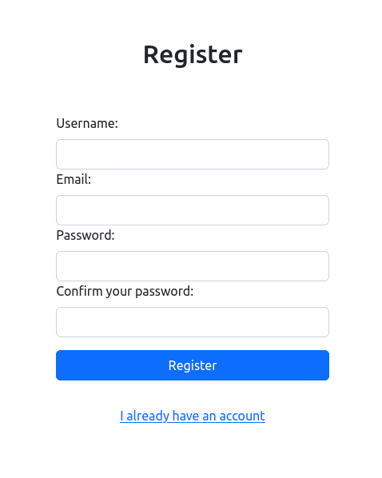

# Gee


## Table of Contents

- [Introduction](#introduction)
- [Features](#features)
- [Technologies Used](#technologies-used)
- [Setup and Installation](#setup-and-installation)
- [Usage](#usage)
- [API Documentation](#api-documentation)
- [Contributing](#contributing)
- [License](#license)

## Introduction

This is a full-stack web application built to provide [brief description of the application's purpose and main functionality]. It allows users to [mention the core features or user actions it supports].

## Features

- Locates places to eat for people with restriction in the selected area of the map
- Allow people to register new places

## Technologies Used

- Frontend:

  - Jinja2
  - Google Maps JavaScript API

- Backend:

  - alembic
  - bcrypt
  - celery
  - elasticsearch
  - fastapi
  - Google Geocoding API
  - Google Places Autocomplete API
  - passlib
  - Pillow
  - psycopg2
  - pydantic
  - python-dotenv
  - python-jose
  - python-multipart
  - requests
  - SQLAlchemy
  - tenacity
  - uvicorn

- Database:
  - PostgreSQL

## Setup and Installation

To run this application locally, follow these steps:

1. Make sure you have [Docker](https://docs.docker.com/engine/install/) and [Docker Compose](https://docs.docker.com/compose/install/) installed
2. Clone the repository: `git clone https://github.com/xlurio/gee.git`
3. Navigate to the project directory: `cd gee`
4. Create a .env file and fill with the [variables needed](#environment-variables)
5. Build the images with the command:

- For Windows:
```
$ docker-compose build
```

- For unix-like:
```
$ sudo docker compose build
```

6. Start the containers with the command:

- For Windows:
```
$ docker-compose up
```

- For unix-like:
```
$ sudo docker compose up
```

7. Now you need to wait until the contained applications are initialized. Onde you see the log `INFO:     Uvicorn running on http://0.0.0.0:8000 (Press CTRL+C to quit)` you should be able to access the Gee by accessing `http://localhost:8000` at your favorite web browser.

## Environment Variables

Before running the application, make sure to set the following environment variables:

### Required

- **GOOGLEMAPSJS_API_KEY**: an [API key](https://developers.google.com/maps/documentation/javascript/get-api-key) needed for the Google Maps JavaScript API
- **GOOGLEGEOCODINGAPI_API_KEY**: an [API key](https://developers.google.com/maps/documentation/geocoding/get-api-key) needed for the Google Geocoding API
- **GOOGLEPLACESAPI_API_KEY**: an [API key](https://developers.google.com/maps/documentation/geocoding/get-api-key) needed for the Google Places Autocomplete API
- **SECRET_KEY**: secret key which will be used to generate the JWT tokens
- **DATABASE_PROTOCOL**: the protocol for the relational database (`postgresql`, `mysql`, `sqlite`, etc) (if using the default docker compose, it will be `postgresql`)
- **DATABASE_HOST**: the host for the relational database server (if using the default docker compose, it will be `database`)
- **DATABASE_PORT**: the port for the relational database server (if using the default docker compose, it will be `5432`)
- **DATABASE_NAME**: the name of the database to be used in the relational database server
- **ELASTICSEARCH_PROTOCOL**: the protocol to be used for the Elastic Search requests (`http` or `https`) (if using the default docker compose, it will be `http`)
- **ELASTICSEARCH_HOST**: the host to be used for the Elastic Search requests (if using the default docker compose, it will be `search`)
- **ELASTICSEARCH_PORT**: the port to be used for the Elastic Search requests (if using the default docker compose, it will be `9200`)
- **BROKER_PROTOCOL**: the protocol to be used for the message broker, needed for `Celery` task queue (if using the default docker compose, it will be `amqp`)
- **BROKER_HOST**: the protocol to be used for the message broker, needed for `Celery` task queue (if using the default docker compose, it will be `broker`)
- **BROKER_PORT**: the protocol to be used for the message broker, needed for `Celery` task queue (if using the default docker compose, it will be `5672`)
- **SMTP_HOST**: the host to be used for the SMTP server (if using the default docker compose, it will be `mail`)
- **SMTP_PORT**: the port to be used for the SMTP server (if using the default docker compose, it will be `1025`)
- **SENDER_EMAIL**: the e-mail which will be used as the mail sender

### Optional

- **DATABASE_USER**: the username to connect to the relational database server if needed (if using the default docker compose, it will be `postgres`)
- **DATABASE_PASSWORD**: the password to connect to the relational database server if needed (if using the default docker compose, it will be `postgres`)
- **BROKER_USERNAME**: the username to connect to the message broker if needed (if using the default docker compose, it will be `rabbit`)
- **BROKER_PASSWORD**: the password to connect to the message broker if needed (if using the default docker compose, it will be `rabbit`)
- **SMTP_USERNAME**: the username to connect to the SMTP server if needed (if using the default docker compose, it must be blank)
- **SMTP_PASSWORD**: the password to connect to the SMTP server if needed (if using the default docker compose, it must be blank)

You can set the environment variables in a .env file in the root of the project.

## Usage

Once you access the application, you should be seeing the following page:


As you just started the application, the map will still be without any place marked. To mark a place you can click on the round button with a plus sign in the middle, located at low left corner. You will be then redirected to the login page:


As you don't have any account registered yet, click at "create new account" link to register a new account. You will be redirected to the register form:



Fill the required information and click at the "register" button. After being redirected to the login form again, fill the username and password field, click at the "login" button and you will be redirected to the place creation form:


Fill the information about the place and, once you drag the map to the area where the place stays, a marker should appear and the information about the place will be at the sidebar:


Now just you can continue to register new places or just eat some vegan cake at the place you just registered.

## API Documentation

### List Places By Bounds

- **Path**: /api/places/{north}/{east}/{south}/{west}
- **Method**: GET
- **Summary**: List Places By Bounds
- **Description**: Get a list of all registered places within the specified bounds.
- **Parameters**:
  - **north** (path) (required) - North bound of the map (latitude)
    - **Schema**: Number
  - **east** (path) (required) - East bound of the map (longitude)
    - **Schema**: Number
  - **south** (path) (required) - South bound of the map (latitude)
    - **Schema**: Number
  - **west** (path) (required) - West bound of the map (longitude)
    - **Schema**: Number
- **Responses**:
  - **200**: Successful Response
    - **Content Type**: application/json
    - **Response Example**:
      ```json
      [
        {
          "name": "Example Place 1",
          "description": "This is an example place 1",
          "street": "Main Street",
          "number": 123,
          "city": "Example City",
          "country": "Example Country",
          "categories": ["restaurant", "cafe"],
          "id": 1,
          "posted_by_id": 123,
          "image": "<image_url_1>",
          "latitude": 37.7749,
          "longitude": -122.4194
        },
        {
          "name": "Example Place 2",
          "description": "This is an example place 2",
          "street": "Oak Street",
          "number": 456,
          "city": "Another City",
          "country": "Another Country",
          "categories": ["bar"],
          "id": 2,
          "posted_by_id": 456,
          "image": "<image_url_2>",
          "latitude": 37.7749,
          "longitude": -122.4194
        }
      ]
      ```
  - **400**: Bad Request
    - **Content Type**: application/json
    - **Response Example**:
      ```json
      {
        "detail": "Bad Request"
      }
      ```
  - **403**: Forbidden
    - **Content Type**: application/json
    - **Response Example**:
      ```json
      {
        "detail": "Forbidden"
      }
      ```
  - **422**: Validation Error
    - **Content Type**: application/json
    - **Response Example**:
      ```json
      {
        "detail": [
          {
            "loc": ["string"],
            "msg": "string",
            "type": "string"
          }
        ]
      }
      ```

### Create Place

- **Path**: /api/places
- **Method**: POST
- **Summary**: Create Place
- **Description**: Mark a new place on the map.
- **Request Body**:
  - **Content Type**: multipart/form-data
  - **Request Example**:
    ```
    place_image: <binary>
    name: "Example Place"
    description: "This is an example place"
    street: "Main Street"
    number: 123
    city: "Example City"
    country: "Example Country"
    categories: ["restaurant", "cafe"]
    ```
- **Responses**:
  - **201**: Successful Response
    - **Content Type**: application/json
    - **Response Example**:
      ```json
      {
        "name": "Example Place",
        "description": "This is an example place",
        "street": "Main Street",
        "number": 123,
        "city": "Example City",
        "country": "Example Country",
        "categories": ["restaurant", "cafe"],
        "id": 3,
        "posted_by_id": 789,
        "image": "<image_url_3>",
        "latitude": 37.7749,
        "longitude": -122.4194
      }
      ```
  - **400**: Bad Request
    - **Content Type**: application/json
    - **Response Example**:
      ```json
      {
        "detail": "Bad Request"
      }
      ```
  - **403**: Forbidden
    - **Content Type**: application/json
    - **Response Example**:
      ```json
      {
        "detail": "Forbidden"
      }
      ```
  - **422**: Validation Error
    - **Content Type**: application/json
    - **Response Example**:
      ```json
      {
        "detail": [
          {
            "loc": ["string"],
            "msg": "string",
            "type": "string"
          }
        ]
      }
      ```
- **Security**: OAuth2PasswordBearer

### Create User

- **Path**: /api/users/
- **Method**: POST
- **Summary**: Create User
- **Description**: Create a new user.
- **Request Body**:
  - **Content Type**: application/json
  - **Request Example**:
    ```json
    {
      "username": "example_user",
      "email": "user@example.com",
      "password": "password123",
      "password_confirmation": "password123"
    }
    ```
- **Responses**:
  - **201**: Successful Response
    - **Content Type**: application/json
    - **Response Example**:
      ```json
      {
        "username": "example_user",
        "email": "user@example.com",
        "id": 789,
        "is_active": true
      }
      ```
  - **400**: Bad Request
    - **Content Type**: application/json
    - **Response Example**:
      ```json
      {
        "detail": "Bad Request"
      }
      ```
  - **403**: Forbidden
    - **Content Type**: application/json
    - **Response Example**:
      ```json
      {
        "detail": "Forbidden"
      }
      ```
  - **422**: Validation Error
    - **Content Type**: application/json
    - **Response Example**:
      ```json
      {
        "detail": [
          {
            "loc": ["string"],
            "msg": "string",
            "type": "string"
          }
        ]
      }
      ```

### Generate Token

- **Path**: /api/token
- **Method**: POST
- **Summary**: Generate Token
- **Description**: Pass your credentials to this endpoint to generate a token.
- **Request Body**:
  - **Content Type**: application/x-www-form-urlencoded
  - **Request Example**:
    ```
    grant_type: "password"
    username: "example_user"
    password: "password123"
    scope: ""
    client_id: "client_id"
    client_secret: "client_secret"
    ```
- **Responses**:
  - **200**: Successful Response
    - **Content Type**: application/json
    - **Response Example**:
      ```json
      {
        "token": "<your_generated_token>"
      }
      ```
  - **400**: Bad Request
    - **Content Type**: application/json
    - **Response Example**:
     

      ```json
      {
        "detail": "Bad Request"
      }
      ```
  - **403**: Forbidden
    - **Content Type**: application/json
    - **Response Example**:
      ```json
      {
        "detail": "Forbidden"
      }
      ```
  - **422**: Validation Error
    - **Content Type**: application/json
    - **Response Example**:
      ```json
      {
        "detail": [
          {
            "loc": ["string"],
            "msg": "string",
            "type": "string"
          }
        ]
      }
      ```

To add a section to the README.md file with previewed improvements, you can follow the markdown format to present the upcoming features or enhancements. Here's an example of how you can do it:

## Planned Improvements

We are continuously working on improving our FastAPI web application. Below are some of the upcoming features and enhancements that we plan to implement:

## Features

1. **My Places**: Allow users to manage places they favorited or marked.

2. **Favorites**: Introduce a favorites feature that allows users to save and manage their favorite places on the map.

3. **Rating and Reviews**: Implement a rating and review system for places, enabling users to share their experiences and feedback.

4. **Advanced Search**: Enhance the search functionality to allow users to search for places based on specific categories, keywords, and location proximity.

5. **Localization Support**: Add support for multiple languages to make the application more accessible to a global audience.

6. **Social Media Integration**: Enable users to share places and their experiences on social media platforms like Facebook and Twitter.

7. **User Authentication Enhancements**: Strengthen user authentication by authorizing users using session instead of local storage.

8. **Improved Error Handling**: Enhance error handling and error messages to provide users with more informative feedback.

9. **Admin Dashboard**: Create an admin dashboard with analytics and insights to manage user data and monitor application usage.

10. **Performance Optimization**: Continuously optimize the backend and frontend code to improve overall application performance.

## Internals

1. **Tests**: Implement unit tests to grant the application integrity

2. **Formatters and Linters**: Integrate formatters and linters to standardize code style

4. **CI/CD**: Automatize testing and deploying to speed up the development

5. **Docstrings**: Add docstrings to functions, methods, classes and modules to improve code readability

Please note that the above improvements are subject to change based on user feedback and evolving project requirements. We are always open to suggestions and welcome contributions from the community to make our FastAPI web application even better.

Stay tuned for updates as we roll out these exciting features in the upcoming releases!

## Contributing

We welcome contributions to improve the application. To contribute:

1. Fork the repository
2. Create a new branch: `git checkout -b feature/your-feature-name`
3. Commit your changes: `git commit -m "Add some feature"`
4. Push to the branch: `git push origin feature/your-feature-name`
5. Submit a pull request

## License

[MIT License](./LICENSE)

## Contact

E-mail: lucas.c.calegario@outlook.com
LinkedIn: https://www.linkedin.com/in/lucas-matheus-corr%C3%AAa-calegario-0949b11b7/

We hope you enjoy using our application! Feel free to reach out to us for any questions or feedback. Happy coding!
